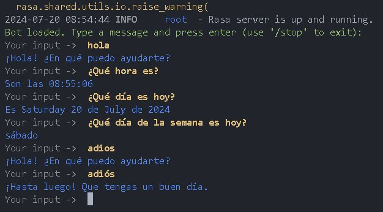

# Tell-me-the-time bot in Spanish

This is a simple bot that tells you the current time in Spanish. It is built using Rasa 3.1.

- `rasa train` to train the model
- `rasa run actions` to run the action server
- `rasa shell` to talk to the bot

